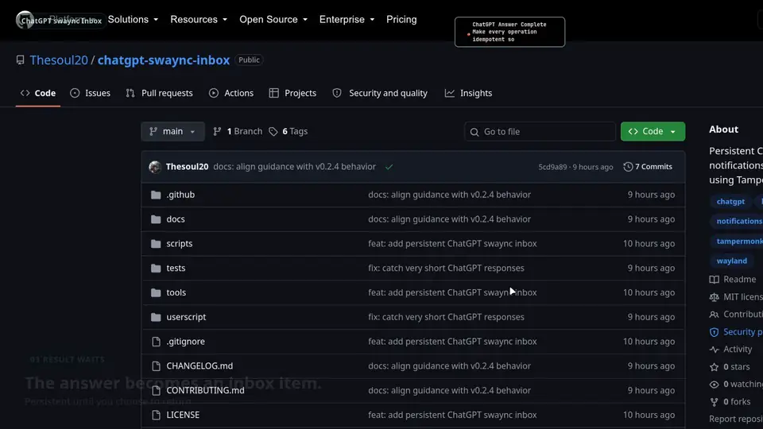

<h1 align="center">ChatGPT swaync Inbox</h1>

<p align="center">
  <strong>Persistent ChatGPT completion inbox for Linux / Wayland.</strong><br>
  Ask. Keep working. The result waits. Click to return.
</p>

<p align="center">
  
  
  
  <a href="LICENSE"></a>
</p>

<p align="center">
  <a href="#quick-start"><strong>Quick Start</strong></a>
  ·
  <a href="docs/assets/demo/main-demo.mp4"><strong>Watch the full 23s demo</strong></a>
  ·
  <a href="docs/architecture.md">Architecture</a>
  ·
  <a href="docs/troubleshooting.md">Troubleshooting</a>
</p>

<p align="center">
  <a href="docs/assets/demo/main-demo.mp4">
    
  </a>
</p>

> **Task completed ≠ interrupt the user.**<br>
> **Task completed = a result enters the inbox until the user is ready to handle it.**

`chatgpt-swaync-inbox` turns finished ChatGPT web responses into persistent Linux desktop results. A completion can arrive while you stay focused on another app, remain in `swaync`, and return you to the originating ChatGPT conversation only when you explicitly click it.

## Demo

The product loop is intentionally small:

| ASK | KEEP WORKING | RESULT WAITS | CLICK TO RETURN |
|---|---|---|---|
| Send a ChatGPT task. | Move on to real work. | The completed result persists in swaync without stealing focus. | Handle the notification when ready and return to the source chat. |

The preview above and the [full 23.5-second showcase](docs/assets/demo/main-demo.mp4) use real product behavior for the important interaction claims: background completion, persistent Inbox state, explicit notification handling, and return to the originating ChatGPT context.

## Why this exists

Desktop completion notifications already exist. The missing workflow is what happens **after** the toast disappears.

| Typical completion notifier | ChatGPT swaync Inbox |
|---|---|
| ChatGPT finishes | ChatGPT finishes |
| A transient notification appears | A persistent swaync result appears |
| The toast may disappear while you are busy | The result stays until you handle it |
| Returning to the right task is manual | Clicking returns toward the originating ChatGPT conversation |

This repository is therefore not another generic “ChatGPT finished” notifier. It treats a finished response like an **unread task result**.

## What you get

- **Persistent result inbox** — the matching ChatGPT completion is promoted to critical urgency and kept by swaync until handled.
- **No focus stealing on arrival** — a completed answer does not interrupt the app you are currently using.
- **Click to return** — explicit notification handling reactivates the originating ChatGPT context instead of opening a new browser tab.
- **Conversation-bound return** — each result captures its conversation URL so the same source tab can return to that chat even if it later moved elsewhere.
- **Local only** — no backend, ChatGPT API key, analytics, telemetry, or conversation upload.
- **Reversible desktop integration** — installation backs up and records the swaync state needed for uninstall to restore prior values.

## Quick Start

### 1. Clone

```bash
git clone https://github.com/Thesoul20/chatgpt-swaync-inbox.git
cd chatgpt-swaync-inbox
```

### 2. Install the swaync integration

```bash
./scripts/install-swaync.sh
```

The installer adds one exact-title swaync rule for `ChatGPT Answer Complete`, configures persistence, and installs the Hyprland click-focus helper used when that compositor is available.

> **Important:** persistence uses swaync's global `timeout-critical=0`. If your previous value was non-zero, installing this project makes **all critical swaync notifications persistent**, not only ChatGPT notifications. The installer warns before changing an existing non-zero value. See [Architecture](docs/architecture.md#persistence-and-the-critical-timeout) for the trade-off.

### 3. Install the userscript

Open:

```text
userscript/chatgpt-swaync-inbox.user.js
```

in Tampermonkey or Violentmonkey, install it, allow it to run on `https://chatgpt.com/*`, and reload any already-open ChatGPT tabs.

### 4. Verify the desktop path

```bash
./scripts/doctor.sh
./scripts/test-notification.sh
```

The test notification should remain in swaync until you dismiss it.

You can also open the userscript-manager menu on ChatGPT and run:

```text
Send test notification
```

### 5. Use ChatGPT normally

Leave a ChatGPT task running, switch to something else, and handle the persistent result when you are ready.

## How it works

```text
ChatGPT Web
   ↓
Tampermonkey / Violentmonkey userscript
   ↓
hybrid completion detection
   ↓
GM_notification → browser → org.freedesktop.Notifications
   ↓
swaync exact-title critical rule
   ↓
persistent result inbox
   ↓
explicit notification action
   ↓
originating ChatGPT context
```

The browser and desktop layers remain intentionally separate: the userscript decides when an answer truly finished; swaync decides how that local notification behaves. See [Architecture](docs/architecture.md) for the full boundary and persistence model.

## Usage

When a response truly finishes, the userscript emits:

```text
ChatGPT Answer Complete
<preview of the final assistant answer>
```

The notification is passive when it appears. Your current application remains focused.

### Click-to-return behavior

Completion notifications are conversation-bound. The userscript intentionally does not give `GM_notification` a `url` field, because userscript managers may interpret that as “open this URL” and create a new tab. It also omits `highlight: true`, so completion does not intentionally steal focus.

When you explicitly click a completion notification:

1. the notification click handler prevents the default open-URL behavior and briefly prefixes the source tab title with `[ChatGPT Inbox Return]`;
2. `@grant window.focus` lets Tampermonkey/Violentmonkey activate the tab that emitted the notification;
3. on Hyprland, swaync's title-scoped `run-on: action` hook waits briefly for that marker and asks Hyprland to focus the exact Firefox window;
4. if the source tab is still on the captured conversation, it returns toward the completed answer;
5. if that tab has since moved to another ChatGPT conversation, the **same tab** is navigated back to the captured conversation URL.

The Hyprland helper is a compositor-level fallback for Firefox/Wayland. Other desktops keep the userscript-manager focus path, whose focus behavior can vary by browser/compositor.

## Reliability and safety

The project is deliberately conservative because a completion notifier is only useful if it does not spam false positives or damage an existing desktop configuration.

### Completion detection

- Uses a **hybrid detector**: same-origin ChatGPT conversation resource completion is the primary signal, with a conservative DOM state-machine fallback.
- The DOM fallback is event-driven with a throttled `MutationObserver`; a 400 ms poll exists only as a safety net.
- A new user prompt arms the generation cycle only after a recent Send/Enter/form-submit signal, so ordinary conversation navigation stays fail-quiet.
- The preview is bound to the assistant turn following the **latest user prompt**, avoiding stale-answer notifications.
- Recent manual Stop actions and obvious generation errors suppress success notifications.
- DOM fallback requires a real generation cycle, prompt-bound assistant activity, no active Stop control, and a stabilization window.

### Minimal desktop mutation

The swaync integration is intentionally narrow:

- one named visibility rule matching the exact summary `ChatGPT Answer Complete`;
- one title-scoped `run-on: action` helper for click-to-return focus;
- backup before modification;
- recorded install state for reversible uninstall;
- no background service owned by this project.

The installer stores enough state to restore the previous critical timeout, previous same-name rule, and previous same-name action-script values.

### Uninstall

```bash
./scripts/uninstall-swaync.sh
```

This removes the project-owned swaync rule and action script, removes the installed Hyprland focus helper, and restores the `timeout-critical` value recorded at installation time. Remove the userscript separately from your userscript manager.

## Requirements

- Linux desktop using Wayland or X11
- `swaync` (SwayNotificationCenter)
- `libnotify` / `notify-send` for diagnostics
- Firefox or a Chromium-family browser
- Tampermonkey or Violentmonkey with permission to run on `https://chatgpt.com/*`
- Python 3

Tested initially on:

- Arch Linux
- Hyprland
- swaync 0.12.6
- Firefox 154
- Tampermonkey 5.5.0

Other swaync-based Wayland desktops should work, but are not yet part of the tested matrix.

## Diagnostics and tests

Run the environment doctor with:

```bash
make doctor
```

It checks:

- required commands;
- whether swaync is running;
- whether a desktop D-Bus session is visible;
- whether the project rule and click-focus action script are installed;
- whether the Hyprland focus helper is present and executable;
- whether `timeout-critical=0`;
- DND and inhibition state when queryable.

Run the automated suite with:

```bash
make test
```

The suite covers swaync config installation/restoration, userscript static checks, and detector logic including conversation-path recognition, prompt-bound turn selection, recent-submit gating, error tokens, manual-stop guard windows, and conversation-restoration decisions.

For recovery steps, see [Troubleshooting](docs/troubleshooting.md).

## Comparison and related work

Several projects already solve answer-completion notification itself:

| Project | Primary focus | Completion detection | Persistent swaync inbox |
|---|---|---|---|
| [ramhaidar/ChatGPT-Response-Complete-Notifier](https://github.com/ramhaidar/ChatGPT-Response-Complete-Notifier) | Browser/userscript completion notifications + sound | Browser/network and prompt-bound watcher in its newer implementation | No documented swaync integration |
| [kkonstantin08/chatgpt-done-notifier](https://github.com/kkonstantin08/chatgpt-done-notifier) | Chrome MV3 extension, Windows-focused | Conservative DOM state machine | No |
| [scarecrowx913x/ChatGPT-Answer-Done-Notifier](https://github.com/scarecrowx913x/ChatGPT-Answer-Done-Notifier) | Userscript beep + desktop notification + favicon badge | ChatGPT UI state | No documented swaync persistence |
| **chatgpt-swaync-inbox** | Linux/Wayland task-inbox semantics | Hybrid resource-completion signal + prompt-bound resolver + DOM fallback | **Yes — core feature** |

Those projects are good alternatives if you only need a transient browser/OS notification. This repository exists for users who want completed ChatGPT work to behave like an unread desktop task.

No source code from the projects above is included here. They are listed as related work and design references. See [Related work and design provenance](docs/related-work.md) for the reviewed ideas and licensing boundary.

## Known limitations

- ChatGPT is a live web application, so DOM selectors and undocumented same-origin resource paths can change.
- A ChatGPT tab must remain open for a userscript to observe it.
- Manual Stop and visible error detection remain heuristic because ChatGPT does not expose a stable public browser completion API.
- If the primary resource-completion path changes or resource timing is unavailable, the conservative DOM fallback remains active.
- `timeout-critical=0` affects every critical swaync notification, not only ChatGPT.
- Reliable compositor-level click focus is currently implemented specifically for Hyprland. Other desktops keep the userscript-manager focus path, whose Wayland behavior may vary.

See [Troubleshooting](docs/troubleshooting.md) for recovery and known-environment guidance.

## Security and privacy

The userscript is scoped only to `https://chatgpt.com/*`. It reads the rendered final assistant turn only to create a local notification preview.

This project has:

- no backend;
- no ChatGPT API key requirement;
- no analytics or telemetry;
- no conversation upload performed by this project.

See [SECURITY.md](SECURITY.md) for the security policy.

## Development and deeper docs

The README stays product-first. Deeper implementation and recovery material lives in the repository docs:

- [Architecture](docs/architecture.md) — browser/desktop boundaries, persistence model, detector design, and action path.
- [Troubleshooting](docs/troubleshooting.md) — diagnosis and recovery steps.
- [Related work and design provenance](docs/related-work.md) — alternatives, borrowed ideas, and licensing boundary.
- [Demo production notes](docs/assets/demo/README.md) — the accepted v3 showcase and reproducible Remotion production path.

The codebase is intentionally inspectable: shell, Python standard library, and one userscript make up the product path.

## Design principles

1. **Local only** — no server and no ChatGPT API required.
2. **Fail quiet** — prefer missing a notification over spamming false completions.
3. **Minimal OS mutation** — one named swaync rule, one title-scoped action hook, backup first, reversible uninstall.
4. **Browser/desktop separation** — ChatGPT detection and swaync policy are independent layers.
5. **Inspectable** — the product path is small enough to audit directly.

## License

MIT. See [LICENSE](LICENSE).

## Project status

Early public release. The primary path has been validated end-to-end on Arch Linux + Hyprland + Firefox + Tampermonkey + swaync. Contributions for other Wayland compositors, distributions, browsers, and notification daemons are welcome.
